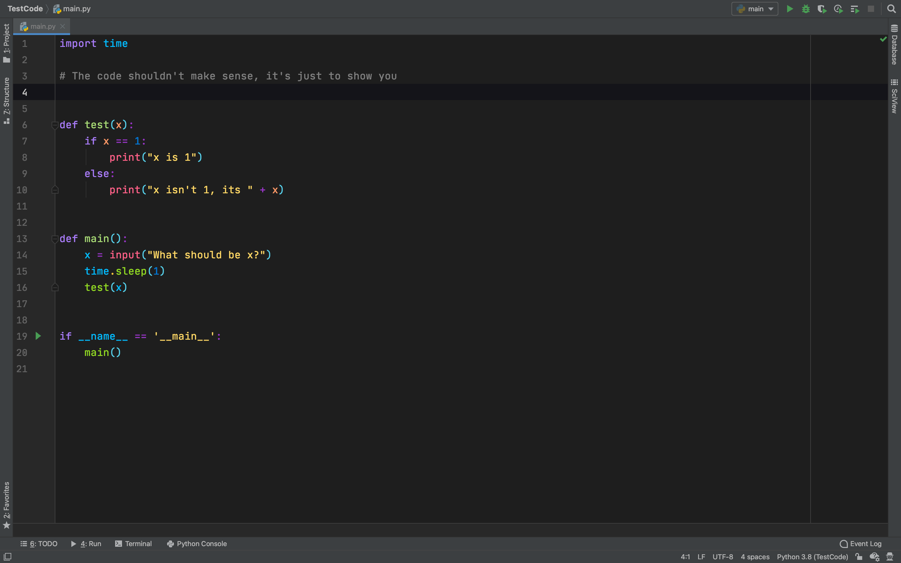

# Cobalt-Amethyst-PyCharm-Scheme
A Pycharm Scheme created by my self called Cobalt Amethyst.

I called it Cobalt Amethyst because the scheme has the amethyst's typical colour like blue and purple.

Heres an example of what it looks like:
 

